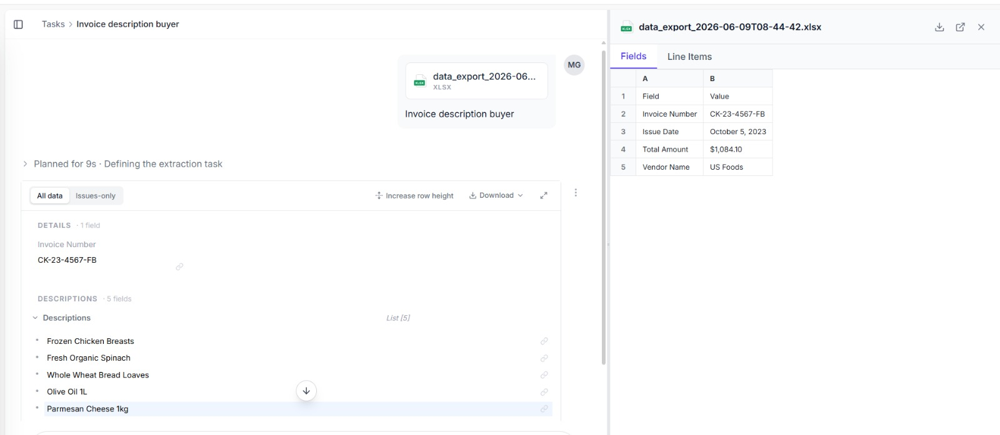

# Logistic Regression Performance Evaluation (Orange Data Mining)

This repository hosts the evaluation metrics and classification results for the Logistic Regression model trained via our visual data mining workflow. 

---

## 📊 Evaluation Results Overview

The model was validated using standard classification performance metrics. Below is the active snapshot of the test suite results showing high predictive capabilities across all core metrics:

### 📈 Model Performance Breakdown

| Model | AUC | Classification Accuracy (CA) | F1-Score | Precision | Recall |
| :--- | :---: | :---: | :---: | :---: | :---: |
| **Logistic Regression** | 0.933 | 0.824 | 0.817 | 0.813 | 0.824 |

* **Area Under ROC (AUC):** $0.933$ indicates excellent discriminative performance between target classes.
* **Overall Accuracy (CA):** $82.4\%$ of total predictions were correctly classified by the model.

---

## 🧩 Confusion Matrix

To further inspect the model's true positives, false positives, true negatives, and false negatives, the confusion matrix highlights exactly where prediction errors occurred:

### 🔍 Analysis of Prediction Splits

| Actual \ Predicted | Class: 0 | Class: 1 | Total |
| :--- | :---: | :---: | :---: |
| **Class: 0** | **True Negatives** | *False Positives* | Row Total |
| **Class: 1** | *False Negatives* | **True Positives** | Row Total |

> **Note:** Use the dynamic selection toggle inside the Orange "Test and Score" widget window to switch between showing **Number of instances** versus **Proportions (Percentages)** within the confusion matrix view.

---

## 🛠️ Validation Configuration

* **Evaluation Method:** 10-Fold Cross-Validation / Stratified Shuffle Split (As configured in the active testing node).
* **Target Variable:** Binary/Categorical classification feature mapped via the preceding `Select Columns` node.
* **Algorithm:** Logistic Regression with optimized regularized hyper-parameters.

---

## 🚀 How to Replicate These Results

1. Open your configured Orange Workspace pipeline (`.ows` file).
2. Double-click on the **Test and Score** widget flask icon.
3. Ensure the **Logistic Regression** learner stream is connected securely to the evaluation node.
4. Review the dynamically generated stats window matching the tables above.
